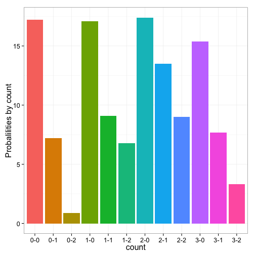

 
# Database with R

* [Data loading and manipulation](#data-loading-and-manipulation)
* [Output](#output)
    * [Table 1\. Proportion of pitches that are "called strikes" among all pitches outside the strikezone\.](#table-1-proportion-of-pitches-that-are-called-strikes-among-all-pitches-outside-the-strikezone)
    * [Table 2\. Proportion of pitches that are "called strikes" among all pitches outside the strikezone by count\.](#table-2-proportion-of-pitches-that-are-called-strikes-among-all-pitches-outside-the-strikezone-by-count)
    * [Figure 1\. Proportion of pitches that are "called strikes" among all pitches outside the strikezone by count\.](#figure-1-proportion-of-pitches-that-are-called-strikes-among-all-pitches-outside-the-strikezone-by-count)

### Data loading and manipulation

* Load webscraped baseball PITCHf/x data to SQLite database. 
* Extract count, called strike, pitch information, merge with umpire dataset.


```r
#setup
library(knitr)
opts_chunk$set(tidy = TRUE, cache=TRUE, autodep=TRUE, message=FALSE)
```


```r
library(pitchRx)
library(dplyr)
library(RSQLite)
library(DBI)
library(ggplot2)

db <- src_sqlite("pitchfx.sqlite3", create = T)

files <- c("inning/inning_all.xml", "players.xml")
scrape(start = "2013-06-01", end = "2013-06-01", suffix = files, connect = db$con)
# dat2 <- scrape(start = '2013-06-01', end = '2013-06-01', suffix = files)

# db <- src_sqlite('pitchfx.sqlite3')

pitch_dt <- tbl(db, "pitch")
umpire_dt <- tbl(db, "umpire")
atbat_dt <- tbl(db, "atbat")
# pitch2_dt <- dat2[['pitch']] umpire_dt <- dat[['umpire']]


atbat <- select(atbat_dt, gameday_link, num, stand, p_throws, inning, pitcher_name)

pitch_umpire <- umpire_dt %>% filter(position == "home") %>% inner_join(pitch_dt, 
    by = "gameday_link") %>% distinct()

# outside_zone
out_zn <- pitch_umpire %>% filter((px < -0.85 | px > 0.85 | pz < sz_bot | pz > 
    sz_top), des %in% c("Called Strike", "Ball")) %>% mutate(cs_ind = as.numeric(des == 
    "Called Strike")) %>% select(position, name, id.x, des, cs_ind, px, pz, 
    sz_top, sz_bot, num, count, gameday_link) %>% collect()

# proportion of called strikes' among all pitches outside the strikezone.

cs_out_zn_all <- out_zn %>% summarize(sum = sum(cs_ind), n = n()) %>% collect() %>% 
    mutate(cs_out_zn = round(100 * sum/n, 1))

names(cs_out_zn_all) <- c("# Called Strikes", "# Pitches", "Called strikes %")

cs_out_zn_count <- out_zn %>% group_by(count) %>% summarize(sum = sum(cs_ind), 
    n = n()) %>% collect() %>% mutate(cs_out_zn = round(100 * sum/n, 1))

figure1 <- ggplot(data = cs_out_zn_count, aes(x = count, y = cs_out_zn, fill = count)) + 
    geom_bar(stat = "identity") + ylab("Probalilities by count") + theme(legend.position = "none")

names(cs_out_zn_count) <- c("Count", "# Called Strikes", "# Pitches", "Called strikes %")
```


### Output

#### Table 1. Proportion of pitches that are "called strikes" among all pitches outside the strikezone.

| # Called Strikes| # Pitches| Called strikes %|
|----------------:|---------:|----------------:|
|              189|      1604|             11.8|

#### Table 2. Proportion of pitches that are "called strikes" among all pitches outside the strikezone by count.

|Count | # Called Strikes| # Pitches| Called strikes %|
|:-----|----------------:|---------:|----------------:|
|0-0   |               85|       495|             17.2|
|0-1   |               17|       235|              7.2|
|0-2   |                1|       112|              0.9|
|1-0   |               30|       175|             17.1|
|1-1   |               16|       176|              9.1|
|1-2   |                9|       133|              6.8|
|2-0   |                8|        46|             17.4|
|2-1   |               10|        74|             13.5|
|2-2   |                8|        89|              9.0|
|3-0   |                2|        13|             15.4|
|3-1   |                2|        26|              7.7|
|3-2   |                1|        30|              3.3|

#### Figure 1. Proportion of pitches that are "called strikes" among all pitches outside the strikezone by count.

 
