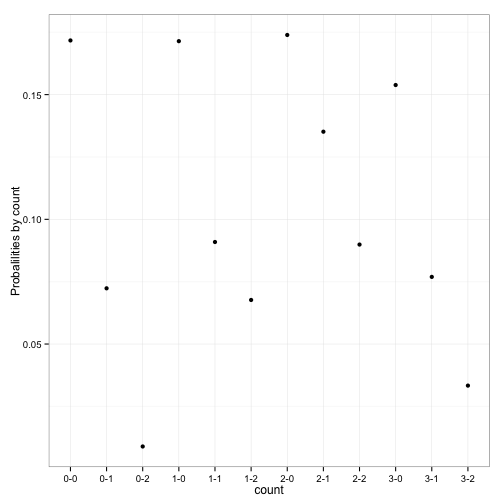

 
# Database with R


```r
# setup
opts_chunk$set(tidy = TRUE, cache = TRUE, autodep = TRUE, message = FALSE)
```


```r
library(pitchRx)
library(dplyr)
library(RSQLite)
library(DBI)
library(ggplot2)

db <- src_sqlite("pitchfx.sqlite3", create = T)

files <- c("inning/inning_all.xml", "players.xml")
scrape(start = "2013-06-01", end = "2013-06-01", suffix = files, connect = db$con)
```

```r
# dat2 <- scrape(start = '2013-06-01', end = '2013-06-01', suffix = files)

# db <- src_sqlite('pitchfx.sqlite3')

pitch_dt <- tbl(db, "pitch")
umpire_dt <- tbl(db, "umpire")
atbat_dt <- tbl(db, "atbat")
# pitch2_dt <- dat2[['pitch']] umpire_dt <- dat[['umpire']]


atbat <- select(atbat_dt, gameday_link, num, stand, p_throws, inning, pitcher_name)

pitch_umpire <- umpire_dt %>% filter(position == "home") %>% inner_join(pitch_dt, 
    by = "gameday_link") %>% distinct()

# outside_zone
out_zn <- pitch_umpire %>% filter((px < -0.85 | px > 0.85 | pz < sz_bot | pz > 
    sz_top), des %in% c("Called Strike", "Ball")) %>% mutate(cs_ind = as.numeric(des == 
    "Called Strike")) %>% select(position, name, id.x, des, cs_ind, px, pz, 
    sz_top, sz_bot, num, count, gameday_link) %>% collect()

# proportion of pitches that are 'called strikes' among all pitches outside
# the strikezone.

cs_out_zn_all <- out_zn %>% summarize(sum = sum(cs_ind), n = n()) %>% collect() %>% 
    mutate(cs_out_zn = sum/n)

kable(cs_out_zn_all)
```


| sum|    n| cs_out_zn|
|---:|----:|---------:|
| 189| 1604| 0.1178304|

```r
# cs_out_zn <- sum(out_zn$cs_ind) / dim(out_zn)[1] cs_out_zn

cs_out_zn_count <- out_zn %>% group_by(count) %>% summarize(sum = sum(cs_ind), 
    n = n()) %>% collect() %>% mutate(cs_out_zn = sum/n)

kable(cs_out_zn_count)
```


|count | sum|   n| cs_out_zn|
|:-----|---:|---:|---------:|
|0-0   |  85| 495| 0.1717172|
|0-1   |  17| 235| 0.0723404|
|0-2   |   1| 112| 0.0089286|
|1-0   |  30| 175| 0.1714286|
|1-1   |  16| 176| 0.0909091|
|1-2   |   9| 133| 0.0676692|
|2-0   |   8|  46| 0.1739130|
|2-1   |  10|  74| 0.1351351|
|2-2   |   8|  89| 0.0898876|
|3-0   |   2|  13| 0.1538462|
|3-1   |   2|  26| 0.0769231|
|3-2   |   1|  30| 0.0333333|

```r
ggplot(data = cs_out_zn_count, aes(x = count, y = cs_out_zn)) + geom_point() + 
    ylab("Probalilities by count") + theme_bw()
```

 
