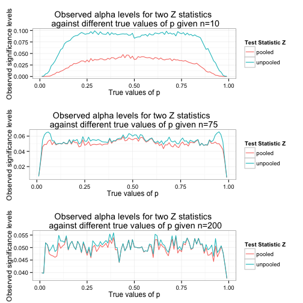

#Investigate the attained alpha level and the power for Z statistics
 
Table of Contents
=================

* [Purpose:](#purpose)
* [To investigate observed alpha levels for pooled and unpooled Z statistics](#to-investigate-observed-alpha-levels-for-pooled-and-unpooled-z-statistics)
* [To investigate the power for pooled and unpooled Z statistics](#to-investigate-the-power-for-pooled-and-unpooled-z-statistics)
* [Summary](#summary)


### Purpose:    
To investigate the attained alpha level and the power for pooled and unpooled Z statistics. Use alpha=0.05 for this project.

### To investigate observed alpha levels for pooled and unpooled Z statistics


```r
library(knitr)
opts_chunk$set(tidy = TRUE, cache=TRUE, autodep=TRUE, message=FALSE)
```


```r
# load library ggplot2 install.packages('ggplot2')
library(ggplot2)

# to load package gridExtra install.packages('gridExtra')
library(gridExtra)

# set a seed
set.seed(502)

# 1(a)(b)set p and n
p <- 0.5
n <- 10

# 1(c)generate two independent samples from a binomial distribution
samp1 <- rbinom(n = 1, size = n, prob = p)
samp2 <- rbinom(n = 1, size = n, prob = p)

# compute p1hat, p2hat and phat
p1hat <- samp1/n
p2hat <- samp2/n
phat <- (p1hat + p2hat)/2

# compute the pooled and unpooled z statistics
zp <- (p1hat - p2hat)/sqrt(2 * phat * (1 - phat)/n)
zunp <- (p1hat - p2hat)/sqrt(p1hat * (1 - p1hat)/n + p2hat * (1 - p2hat))

# 1(d)repeat above N=10000 times

# set N
N <- 10000

# create a matrix stat to save test statistics from each sample
stat <- matrix(NA, N, 2)
colnames(stat) <- c("pooled test", "unpooled test")

# generate N pairs of samples and compute corresponding test statistics
for (i in 1:N) {
    # generate two independent samples from a binomial distribution
    samp1 <- rbinom(n = 1, size = n, prob = p)
    samp2 <- rbinom(n = 1, size = n, prob = p)
    
    # compute p1hat, p2hat and phat
    p1hat <- samp1/n
    p2hat <- samp2/n
    phat <- (p1hat + p2hat)/2
    
    # compute the pooled and unpooled z statistics
    stat[i, 1] <- (p1hat - p2hat)/sqrt(2 * phat * (1 - phat)/n)
    stat[i, 2] <- (p1hat - p2hat)/sqrt(p1hat * (1 - p1hat)/n + p2hat * (1 - 
        p2hat))
}

# 1(e)find the observed type I error for each test

# set alpha
alpha <- 0.05

# get critical point
zcr <- qnorm(1 - alpha/2)

# observed type I error for pooled statistic
(alphap <- sum(abs(stat[, 1]) > zcr)/N)
```

```
## [1] 0.0403
```

```r
# observed type I error for unpooled statistic
(alphaunp <- sum(abs(stat[, 2]) > zcr)/N)
```

```
## [1] 0.0031
```

```r
# 2.create a function to plot the needed plot, set n=10 by default
plotalpha <- function(n = 10) {
    
    # (a)look at alpha level for different true values of p create a vector of p
    pvec <- seq(0.01, 0.99, 0.01)
    
    # get the length of vector pvec
    m <- length(pvec)
    
    # create a matrix alphas to save significance levels for each p
    alphas <- matrix(NA, m, 3)
    colnames(alphas) <- c("pooled test", "unpooled test", "p")
    
    for (i in 1:m) {
        
        # set p
        p <- pvec[i]
        
        # create a matrix stat to save test statistics from each sample
        stat <- matrix(NA, N, 2)
        colnames(stat) <- c("pooled test", "unpooled test")
        
        for (j in 1:N) {
            # generate two independent samples from a binomial distribution
            samp1 <- rbinom(n = 1, size = n, prob = p)
            samp2 <- rbinom(n = 1, size = n, prob = p)
            
            # compute p1hat, p2hat and phat
            p1hat <- samp1/n
            p2hat <- samp2/n
            phat <- (p1hat + p2hat)/2
            
            # compute the pooled and unpooled z statistics
            stat[j, 1] <- ifelse(p1hat == p2hat, 0, (p1hat - p2hat)/sqrt(2 * 
                phat * (1 - phat)/n))
            stat[j, 2] <- ifelse(p1hat == p2hat, 0, (p1hat - p2hat)/sqrt(p1hat * 
                (1 - p1hat)/n + p2hat * (1 - p2hat)/n))
        }
        
        # observed type I error for pooled statistic
        alphas[i, 1] <- sum(abs(stat[, 1]) > zcr)/N
        
        # observed type I error for unpooled statistic
        alphas[i, 2] <- sum(abs(stat[, 2]) > zcr)/N
    }
    
    # save p to the 3rd column of alphas
    alphas[, 3] <- pvec
    
    # (b)plot the two significance level profiles on the same plot
    
    # to prepare data for ggplot
    
    # create a matrix containing alphas for pooled statistics
    alphasp <- cbind(alphas[, c(1, 3)], 1)
    
    # create a matrix containing alphas for unpooled statistics
    alphasunp <- cbind(alphas[, c(2, 3)], 2)
    
    # row bind above two matrices
    alphasnew <- as.data.frame(rbind(alphasp, alphasunp))
    
    colnames(alphasnew) <- c("alphas", "p", "indicator")
    
    # change variable indicator to a factor
    alphasnew$indicator <- as.factor(alphasnew$indicator)
    
    # plot the needed plot
    ggplot(alphasnew, aes(x = p, y = alphas, color = indicator)) + # geom_point() +
    geom_line() + labs(title = paste0("Observed alpha levels for two Z statistics \n against different true values of p given n=", 
        n), x = "True values of p", y = "Observed significance levels") + scale_color_discrete(name = "Test Statistic Z", 
        labels = c("pooled", "unpooled")) + theme_bw()
}

# use self-defined function to plot the required plot
plot1 <- plotalpha()

# 3.use self-defined function to plot for n=75
plot2 <- plotalpha(n = 75)

# 4.use self-defined function to plot for n=75
plot3 <- plotalpha(n = 200)

# 5.plot the three plots in one window
grid.arrange(plot1, plot2, plot3, ncol = 1)
```

 

### To investigate the power for pooled and unpooled Z statistics


```r
# 6.create a function to plot power vs n
plotpow <- function(p1 = 0.5, p2 = 0.4) {
    
    # create a vector of n
    nvec <- seq(10, 150, 1)
    
    # get the length of vector nvec
    m <- length(nvec)
    
    # create a matrix powers to save values of power for each n
    powers <- matrix(NA, m, 3)
    colnames(powers) <- c("pooled test", "unpooled test", "n")
    
    for (i in 1:m) {
        
        # set n
        n <- nvec[i]
        
        # create a matrix stat to save test statistics from each sample
        stat <- matrix(NA, N, 2)
        colnames(stat) <- c("pooled test", "unpooled test")
        
        for (j in 1:N) {
            # generate two independent samples from a binomial distribution
            samp1 <- rbinom(n = 1, size = n, prob = p1)
            samp2 <- rbinom(n = 1, size = n, prob = p2)
            
            # compute p1hat, p2hat and phat
            p1hat <- samp1/n
            p2hat <- samp2/n
            phat <- (p1hat + p2hat)/2
            
            
            # compute the pooled and unpooled z statistics under H1
            stat[j, 1] <- ifelse(p1hat == p2hat, 0, (p1hat - p2hat)/sqrt(2 * 
                phat * (1 - phat)/n))
            stat[j, 2] <- ifelse(p1hat == p2hat, 0, (p1hat - p2hat)/sqrt(p1hat * 
                (1 - p1hat)/n + p2hat * (1 - p2hat)/n))
        }
        
        # power for pooled statistic
        powers[i, 1] <- sum(abs(stat[, 1]) > zcr)/N
        
        
        # power for unpooled statistic
        powers[i, 2] <- sum(abs(stat[, 2]) > zcr)/N
        
    }
    # save n to the 3rd column of powers
    powers[, 3] <- nvec
    
    # (b)plot the two power profiles on the same plot
    
    # to prepare data for ggplot
    
    # create a matrix containing alphas for pooled statistics
    powersp <- cbind(powers[, c(1, 3)], 1)
    
    # create a matrix containing alphas for unpooled statistics
    powersunp <- cbind(powers[, c(2, 3)], 2)
    
    # row bind above two matrices
    powersnew <- as.data.frame(rbind(powersp, powersunp))
    colnames(powersnew) <- c("powers", "n", "indicator")
    
    # change variable indicator to a factor
    powersnew$indicator <- as.factor(powersnew$indicator)
    
    # plot the needed plot
    ggplot(powersnew, aes(x = n, y = powers, color = indicator)) + # geom_point() +
    geom_line() + labs(title = paste0("Powers for two Z statistics against different values \n of n given p1=", 
        p1, " and p2=", p2), x = "n", y = "Power") + scale_color_discrete(name = "Test Statistic Z", 
        labels = c("pooled", "unpooled")) + theme_bw()
}

# use self-defined function to plot power vs n for p1=0.5 and p2=0.4
pow1 <- plotpow()

# 7.to investigate power using p1=0.7 and p2=0.4

pow2 <- plotpow(p1 = 0.7, p2 = 0.4)

# 8.to investigate power using p1=0.95 and p2=0.85

pow3 <- plotpow(p1 = 0.95, p2 = 0.85)

# 9.plot all three plots in one window

grid.arrange(pow1, pow2, pow3, ncol = 1)
```

 

### Summary

When the common p equals 0.5, we find that the pooled Z test statistic is better for small sample sizes in terms of type I error, compared to the unpooled Z test statistic.

But for large sample sizes, these two test statistics' performance is similar in terms of type I error. 

In terms of power, when the difference between p1 and p2 is relatively large, the power for both satistics is larger compared to smaller difference between p1 and p2. Also when p1 and p2 are both relatively large, the power is larger compared to condition that p1 and p2 are close to 0.5. In addition, the power becomes larger for both of the two test statistics as n grows bigger no matter what values p1 and p2 are. 

To compare the two test statistics, when p1 and p2 are both large, the power for both test statistics is close to each other. When p1 and p2 are both close to 0.5, it seems unpooled test statistic is a little better. When the difference between p1 and p2 is relatively large and sample size is small, the unpooled Z test statistic is a little better, while they are similar as n is big.

