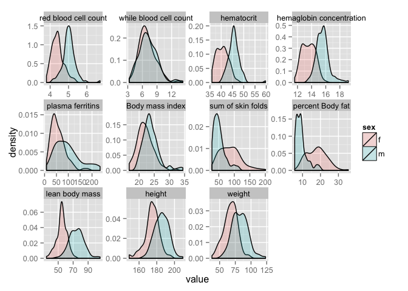

    library(knitr)
    opts_chunk$set(tidy = TRUE, cache=TRUE, autodep=TRUE, message=FALSE)

    library(DAAG)
    library(ggplot2)
    library(tidyr)
    library(GGally)
    library(gplots)

    data(ais)

    heatmap.2(as.matrix(ais[1:11]))

    ggpairs(ais[,1:11])

    ais_long <- gather(ais, key = measure, value = value, rcc:wt)

    levels(ais_long$measure) <- c("red blood cell count", "while blood cell count",
                                  "hematocrit", "hemaglobin concentration",
                                  "plasma ferritins", "Body mass index", 
                                  "sum of skin folds", "percent Body fat",
                                  "lean body mass", "height", 
                                  "weight")

    ggplot(data = ais_long, aes(value)) + geom_histogram() +
        facet_wrap( ~ measure, scales = "free")

    ggparcoord(ais, columns = 1:11, groupColumn = "sex") +
               scale_colour_manual(values = c("grey", "red"))

    ggparcoord(ais, columns = 1:11, groupColumn = "sport")

