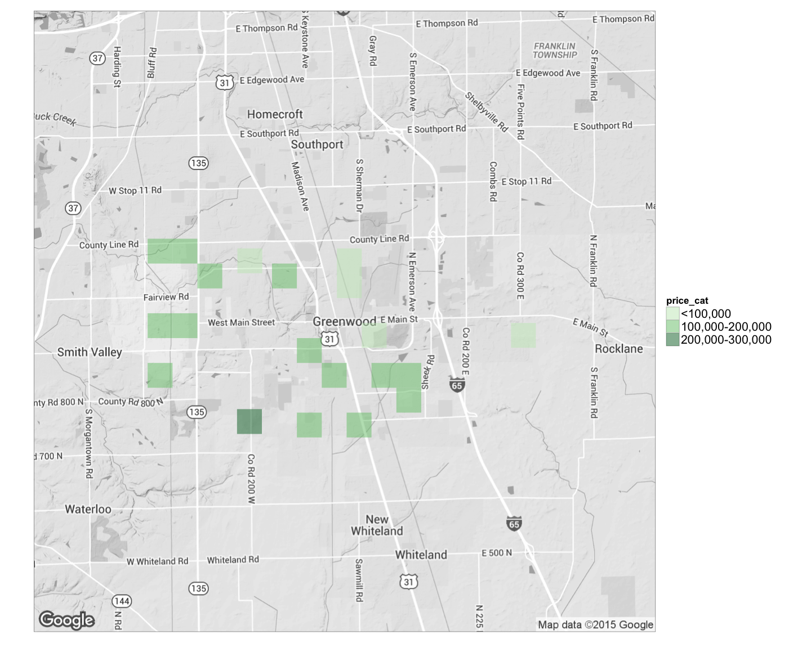

# Web technology with R

Table of Contents
=================

* [1\. Using API](#1-using-api)
    * [Demonstrate using Zillow official API to extract information](#demonstrate-using-zillow-official-api-to-extract-information)
* [2\. Explore Zillow data using rvest](#2-explore-zillow-data-using-rvest)
      * [Alternatively, scrape Zillow website to get richer information and geocoding the address](#alternatively-scrape-zillow-website-to-get-richer-information-and-geocoding-the-address)
* [3\. Mapping](#3-mapping)
      * [Visualize relationship between real estate location and value in a map](#visualize-relationship-between-real-estate-location-and-value-in-a-map)

1. Using API
------------

<http://www.zillow.com/howto/api/GetSearchResults.htm>

### Demonstrate using Zillow official API to extract information

    library(knitr)
    opts_chunk$set(tidy = TRUE, cache=TRUE, autodep=TRUE, message=FALSE)

    library(httr)
    library(rvest)

    ## Loading required package: xml2

    library(magrittr)
    library(ggmap)

    ## Loading required package: ggplot2
    ## 
    ## Attaching package: 'ggmap'
    ## 
    ## The following object is masked from 'package:magrittr':
    ## 
    ##     inset

    library(stringr)
    library(knitr)
    library(xml2)
     
    sample <- GET("http://www.zillow.com/webservice/GetSearchResults.htm", 
                  query = list('zws-id' = "X1-ZWz1f063o0dzij_7yjzz", 
                               address = "2114 Bigelow Ave",
                               citystatezip = "Seattle, WA"))

    result <- read_xml(content(sample, "text"))

    zpid <- result %>% html_node("zpid")%>%html_text()
    amount <- result %>% html_node("amount")%>%html_text()
    low <- result %>% html_node("low")%>%html_text()
    high <- result %>% html_node("high")%>%html_text()
    valueChange30Day <- result %>% html_node("valueChange")%>%html_text()
    kable(data.frame(zpid,amount,low,high,valueChange30Day))

<table>
<thead>
<tr class="header">
<th align="left">zpid</th>
<th align="left">amount</th>
<th align="left">low</th>
<th align="left">high</th>
<th align="left">valueChange30Day</th>
</tr>
</thead>
<tbody>
<tr class="odd">
<td align="left">48749425</td>
<td align="left">1425219</td>
<td align="left">1339706</td>
<td align="left">1539237</td>
<td align="left">144</td>
</tr>
</tbody>
</table>

2. Explore Zillow data using rvest
----------------------------------

### Alternatively, scrape Zillow website to get richer information and geocoding the address

Hui adapted from
<https://raw.githubusercontent.com/notesofdabbler/blog_notesofdabbler/master/learn_rvest/exploreZillow_w_rvest.R>

    # here the search is filtered to just homes for sale if there are less
    # filters in search, the code will need to be modified since the css might
    # be different for different types of results (eg. homes for sales vs new
    # homes vs homes for rent)
    url = "http://www.zillow.com/homes/for_sale/Greenwood-IN/fsba,fsbo,fore,cmsn_lt/house_type/52333_rid/39.638414,-86.011362,39.550714,-86.179419_rect/12_zm/0_mmm/"

    # get list of houses for sales that appears on the page
    houselist <- url %>% html() %>% html_nodes("article")

    ## Warning: 'html' is deprecated.
    ## Use 'read_html' instead.
    ## See help("Deprecated")

    # Extract zillow id for each listing
    zpid <- houselist %>% html_attr("id") %>% str_replace_all("zpid_", "")

    # get the address for each listing

    staddrlink <- houselist %>% html_node(".property-address a") %>% html_attr("href")
    straddr <- sapply(strsplit(staddrlink, "/"), function(x) x[3])
    straddr <- str_replace_all(straddr, "-", " ")

    lat_lon <- geocode(straddr, source = "google")

    lotsqft <- houselist %>% html_node(".lot-size") %>% html_text() %>% str_replace_all(",", 
        "")
    lotsqft <- sapply(lotsqft, function(x) {
        num <- as.numeric(str_extract_all(x, "(\\d*\\.)?\\d+"))
        if (!is.na(num) & str_detect(x, "(ac|acre)")) {
            num <- num * 43560
        }
        num
    })

    yrbuilt <- houselist %>% html_node(".built-year") %>% html_text()
    yrbuilt <- as.numeric(str_extract_all(yrbuilt, "\\d+"))

    price <- houselist %>% html_node(".price-large") %>% html_text() %>% gsub("[\\$a-zA-Z,]", 
        "", .) %>% as.numeric()

    # house parameters (number of beds, baths, house area)
    houseparams <- houselist %>% html_node(".property-data") %>% html_text()
    houseparamsSplit <- strsplit(houseparams, ", ")
    ## get number of beds
    numbeds <- sapply(houseparamsSplit, function(x) as.numeric(strsplit(x[1], " ")[[1]][1]))
    ## get number of baths
    numbaths <- sapply(houseparamsSplit, function(x) as.numeric(strsplit(x[1], " ")[[1]][4]))

    housesqft <- sapply(houseparamsSplit, function(x) strsplit(x[1], " ")[[1]][7]) %>% 
        str_replace_all(",", "") %>% as.numeric()

    # houseData <-
    # data.frame(zpid,price,yrbuilt,numbeds,numbaths,housesqft,lotsqft,straddr)
    houseData <- data.frame(zpid, price, yrbuilt, numbeds, numbaths, housesqft, 
        lotsqft, straddr, lat_lon)

    kable(houseData[1:6, ])

<table>
<thead>
<tr class="header">
<th align="left">zpid</th>
<th align="right">price</th>
<th align="right">yrbuilt</th>
<th align="right">numbeds</th>
<th align="right">numbaths</th>
<th align="right">housesqft</th>
<th align="right">lotsqft</th>
<th align="left">straddr</th>
<th align="right">lon</th>
<th align="right">lat</th>
</tr>
</thead>
<tbody>
<tr class="odd">
<td align="left">2100551520</td>
<td align="right">235000</td>
<td align="right">2015</td>
<td align="right">4</td>
<td align="right">3.0</td>
<td align="right">2817</td>
<td align="right">10454</td>
<td align="left">1641 Windborne Ln Greenwood IN 46143</td>
<td align="right">-86.14667</td>
<td align="right">39.59392</td>
</tr>
<tr class="even">
<td align="left">85444228</td>
<td align="right">135000</td>
<td align="right">2002</td>
<td align="right">2</td>
<td align="right">2.0</td>
<td align="right">1173</td>
<td align="right">4791</td>
<td align="left">1112 Lincoln Park East Dr Greenwood IN 46142</td>
<td align="right">-86.16448</td>
<td align="right">39.63262</td>
</tr>
<tr class="odd">
<td align="left">2100587200</td>
<td align="right">375000</td>
<td align="right">2013</td>
<td align="right">4</td>
<td align="right">2.5</td>
<td align="right">4074</td>
<td align="right">15246</td>
<td align="left">Brentford Ln Greenwood IN 46143</td>
<td align="right">-86.14453</td>
<td align="right">39.58283</td>
</tr>
<tr class="even">
<td align="left">85442093</td>
<td align="right">10</td>
<td align="right">1800</td>
<td align="right">2</td>
<td align="right">1.0</td>
<td align="right">1114</td>
<td align="right">7840</td>
<td align="left">627 Forest Ave Greenwood IN 46143</td>
<td align="right">-86.09644</td>
<td align="right">39.61269</td>
</tr>
<tr class="odd">
<td align="left">85439013</td>
<td align="right">79900</td>
<td align="right">1960</td>
<td align="right">3</td>
<td align="right">1.0</td>
<td align="right">960</td>
<td align="right">7840</td>
<td align="left">611 Park Dr Greenwood IN 46143</td>
<td align="right">-86.10177</td>
<td align="right">39.62611</td>
</tr>
<tr class="even">
<td align="left">94434235</td>
<td align="right">30</td>
<td align="right">2007</td>
<td align="right">4</td>
<td align="right">3.5</td>
<td align="right">3900</td>
<td align="right">9147</td>
<td align="left">597 Timeless Run Greenwood IN 46143</td>
<td align="right">-86.04300</td>
<td align="right">39.60632</td>
</tr>
</tbody>
</table>

3. Mapping
----------

### Visualize relationship between real estate location and value in a map

    library(ggmap)

    houseData$price_cat[houseData$price > 0] <- 1
    houseData$price_cat[houseData$price > 1e+05] <- 2
    houseData$price_cat[houseData$price > 2e+05] <- 3
    houseData$price_cat[houseData$price > 3e+05] <- 4
    houseData$price_cat <- as.factor(houseData$price_cat)

    theme_set(theme_bw(16))
    gw_in <- qmap("Greenwood IN", color = "bw", zoom = 12)

    gw_in + stat_bin2d(aes(x = lon, y = lat, price_cat, fill = price_cat), size = 0.5, 
        bins = 25, alpha = 1/2, data = houseData) + scale_fill_manual(values = c(`1` = "#c7e9c0", 
        `2` = "#74c476", `3` = "#31a354", `4` = "#006d2c"), labels = c("<100,000", 
        "100,000-200,000", "200,000-300,000", ">300,000")) + 
    theme(axis.line = element_blank(), axis.text.x = element_blank(), axis.text.y = element_blank(), 
        axis.ticks = element_blank(), axis.title.x = element_blank(), axis.title.y = element_blank(), 
        legend.text = element_text(size = 16))

