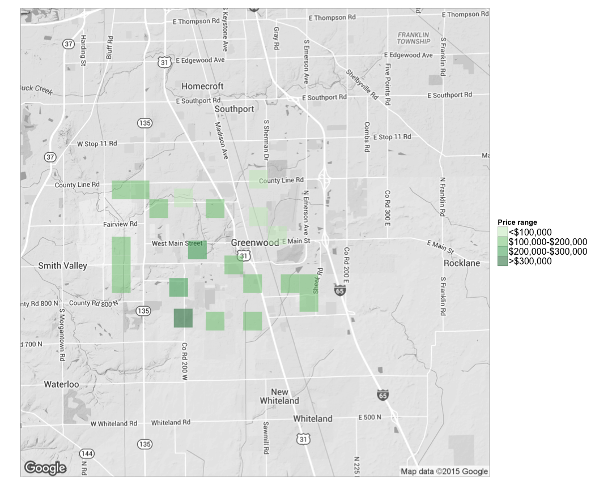

# Web technology with R


* Interactive web application at <https://huili.shinyapps.io/Web_tech>
* [1\. Using API](#1-using-api)
    * [Table1\. Real estate information using Zillow API](#table1-real-estate-information-using-zillow-api)
* [2\. Explore Zillow data by scraping](#2-explore-zillow-data-by-scraping)
    * [Table2\. Real estate information in Greenwood, IN scraped from Zillow](#table2-real-estate-information-in-greenwood-in-scraped-from-zillow)
* [3\. Mapping](#3-mapping)


## 1. Using API 

Instruction: <http://www.zillow.com/howto/api/GetSearchResults.htm>

Demonstrate using Zillow official API to extract information


```r
library(knitr)
opts_chunk$set(tidy = TRUE, cache=TRUE, autodep=TRUE, message=FALSE)
```


```r
library(httr)
library(rvest)
library(magrittr)
library(ggmap)
library(stringr)
library(knitr)
library(xml2)
library(formattable)

sample <- GET("http://www.zillow.com/webservice/GetSearchResults.htm", query = list(`zws-id` = "X1-ZWz1f063o0dzij_7yjzz", 
    address = "2114 Bigelow Ave", citystatezip = "Seattle, WA"))

result <- read_xml(content(sample, "text"))

zpid <- result %>% html_node("zpid") %>% html_text()
amount <- result %>% html_node("amount") %>% html_text() %>% as.numeric() %>% 
    currency()
low <- result %>% html_node("low") %>% html_text() %>% as.numeric() %>% currency()
high <- result %>% html_node("high") %>% html_text() %>% as.numeric() %>% currency()
valueChange30Day <- result %>% html_node("valueChange") %>% html_text() %>% 
    as.numeric() %>% currency()
```


### Table1. Real estate information using Zillow API


|zpid     |        amount|           low|          high| valueChange30Day|
|:--------|-------------:|-------------:|-------------:|----------------:|
|48749425 | $1,422,973.00| $1,351,824.00| $1,494,122.00|       $-1,999.00|


## 2. Explore Zillow data by scraping

Alternatively, scrape Zillow website to get richer information and geocoding the address

Hui adapted from https://raw.githubusercontent.com/notesofdabbler/blog_notesofdabbler/master/learn_rvest/exploreZillow_w_rvest.R
 

```r
# here the search is filtered to just homes for sale if there are less
# filters in search, the code will need to be modified since the css might
# be different for different types of results (eg. homes for sales vs new
# homes vs homes for rent)
url = "http://www.zillow.com/homes/for_sale/Greenwood-IN/fsba,fsbo,fore,cmsn_lt/house_type/52333_rid/39.638414,-86.011362,39.550714,-86.179419_rect/12_zm/0_mmm/"

# get list of houses for sales that appears on the page
houselist <- url %>% read_html() %>% html_nodes("article")

# Extract zillow id for each listing
zpid <- houselist %>% html_attr("id") %>% str_replace_all("zpid_", "")

# get the address for each listing

staddrlink <- houselist %>% html_node(".property-address a") %>% html_attr("href")
straddr <- sapply(strsplit(staddrlink, "/"), function(x) x[3])
straddr <- str_replace_all(straddr, "-", " ")

lat_lon <- geocode(straddr, source = "google")

lotsqft <- houselist %>% html_node(".lot-size") %>% html_text() %>% str_replace_all(",", 
    "")
lotsqft <- sapply(lotsqft, function(x) {
    num <- as.numeric(str_extract_all(x, "(\\d*\\.)?\\d+"))
    if (!is.na(num) & str_detect(x, "(ac|acre)")) {
        num <- num * 43560
    }
    num
})

yrbuilt <- houselist %>% html_node(".built-year") %>% html_text()
yrbuilt <- as.numeric(str_extract_all(yrbuilt, "\\d+"))

price <- houselist %>% html_node(".price-large") %>% html_text() %>% gsub("[\\$a-zA-Z,]", 
    "", .) %>% as.numeric()

# house parameters (number of beds, baths, house area)
houseparams <- houselist %>% html_node(".property-data") %>% html_text()
houseparamsSplit <- strsplit(houseparams, ", ")
## get number of beds
numbeds <- sapply(houseparamsSplit, function(x) as.numeric(strsplit(x[1], " ")[[1]][1]))
## get number of baths
numbaths <- sapply(houseparamsSplit, function(x) as.numeric(strsplit(x[1], " ")[[1]][4]))

housesqft <- sapply(houseparamsSplit, function(x) strsplit(x[1], " ")[[1]][7]) %>% 
    str_replace_all(",", "") %>% as.numeric()

# houseData <-
# data.frame(zpid,price,yrbuilt,numbeds,numbaths,housesqft,lotsqft,straddr)
houseData <- data.frame(zpid, price, yrbuilt, numbeds, numbaths, housesqft, 
    lotsqft, straddr, lat_lon)
```


### Table2. Real estate information in Greenwood, IN scraped from Zillow

|zpid       |  price| yrbuilt| numbeds| numbaths| housesqft| lotsqft|straddr                                      |       lon|      lat|
|:----------|------:|-------:|-------:|--------:|---------:|-------:|:--------------------------------------------|---------:|--------:|
|85441750   |  83000|    1958|       3|        1|      1181| 12196.8|12 Patterson St Greenwood IN 46143           | -86.09198| 39.61548|
|85453095   | 175500|    1996|       4|        3|      2200| 13068.0|801 Lionshead Ln Greenwood IN 46143          | -86.17355| 39.60472|
|2103744591 | 269900|    2015|       3|        2|      1810| 15681.6|537 Weyworth Pl Greenwood IN 46142           | -86.13726| 39.60961|
|85465778   | 109900|    2001|       3|        3|      1325|  4356.0|2391 Providence Ct Greenwood IN 46143        | -86.10520| 39.58174|
|2100551520 | 235000|    2015|       4|        3|      2817| 10454.0|1641 Windborne Ln Greenwood IN 46143         | -86.14667| 39.59392|
|85444228   | 135000|    2002|       2|        2|      1173|  4791.0|1112 Lincoln Park East Dr Greenwood IN 46142 | -86.16448| 39.63262|


## 3. Mapping

Visualize relationship between real estate location and value in a map


```r
library(ggmap)

houseData$price_cat[houseData$price > 0] <- 1
houseData$price_cat[houseData$price > 1e+05] <- 2
houseData$price_cat[houseData$price > 2e+05] <- 3
houseData$price_cat[houseData$price > 3e+05] <- 4
houseData$price_cat <- as.factor(houseData$price_cat)

# for shiny app
saveRDS(houseData, file = "/Users/lei/Desktop/one/Practice/GIT_first/Projects/Web technology with R/Shiny web app/houseData.rds")

theme_set(theme_bw(16))
gw_in <- qmap("Greenwood IN", color = "bw", zoom = 12)

gw_in + stat_bin2d(aes(x = lon, y = lat, fill = price_cat), size = 0.5, bins = 25, 
    alpha = 1/2, data = houseData) + scale_fill_manual(values = c(`1` = "#c7e9c0", 
    `2` = "#74c476", `3` = "#31a354", `4` = "#006d2c"), labels = c("<100,000", 
    "100,000-200,000", "200,000-300,000", ">300,000")) + 
theme(axis.line = element_blank(), axis.text.x = element_blank(), axis.text.y = element_blank(), 
    axis.ticks = element_blank(), axis.title.x = element_blank(), axis.title.y = element_blank(), 
    legend.text = element_text(size = 16))
```

 


