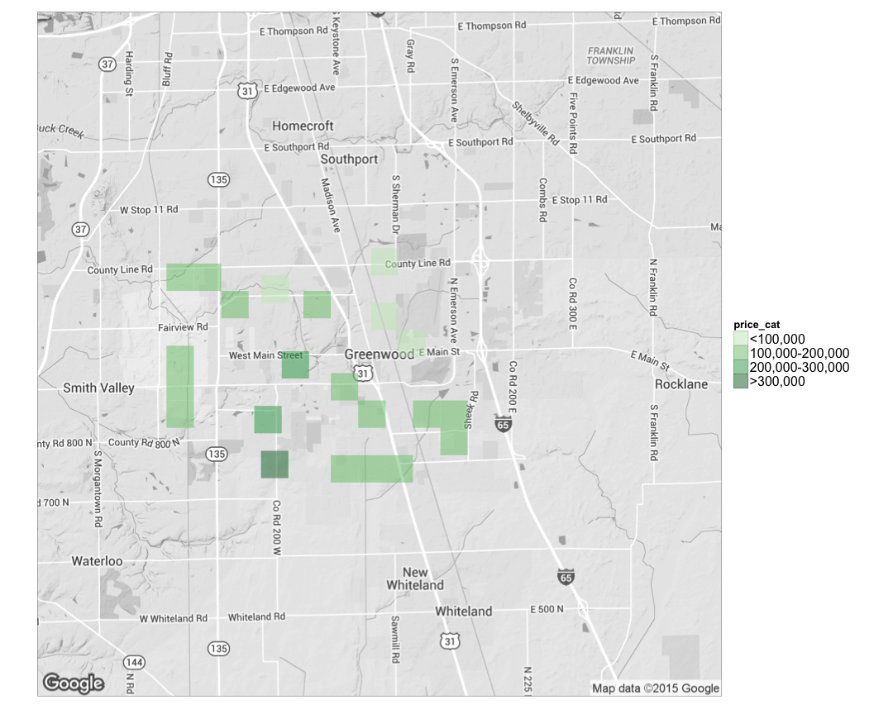

# Web technology with R


## Summary
* Demonstrate using Zillow official API to extract information
* Alternatively, scrape Zillow website to get richer information and geocoding the address
* Visualize relationship between real estate location and value in a map


##1. Using API 
<http://www.zillow.com/howto/api/GetSearchResults.htm>


```r
library(knitr)
opts_chunk$set(tidy = TRUE, cache=TRUE, autodep=TRUE, message=FALSE)

library(httr)
library(rvest)
library(magrittr)
library(ggmap)
library(stringr)
library(knitr)
sample <- GET("http://www.zillow.com/webservice/GetSearchResults.htm", 
              query = list('zws-id' = "X1-ZWz1f063o0dzij_7yjzz", 
                           address = "2114 Bigelow Ave",
                           citystatezip = "Seattle, WA"))

result <- content(sample)

zpid <- result %>% html_node("zpid")%>%html_text()
amount <- result %>% html_node("amount")%>%html_text()
low <- result %>% html_node("low")%>%html_text()
high <- result %>% html_node("high")%>%html_text()
valueChange30Day <- result %>% html_node("valueChange")%>%html_text()
kable(data.frame(zpid,amount,low,high,valueChange30Day))
```


|zpid     |amount  |low     |high    |valueChange30Day |
|:--------|:-------|:-------|:-------|:----------------|
|48749425 |1425219 |1339706 |1539237 |144              |


##2.  Explore Zillow data using rvest

Hui adapted from https://raw.githubusercontent.com/notesofdabbler/blog_notesofdabbler/master/learn_rvest/exploreZillow_w_rvest.R
 

```r
# here the search is filtered to just homes for sale if there are less
# filters in search, the code will need to be modified since the css might
# be different for different types of results (eg. homes for sales vs new
# homes vs homes for rent)
url = "http://www.zillow.com/homes/for_sale/Greenwood-IN/fsba,fsbo,fore,cmsn_lt/house_type/52333_rid/39.638414,-86.011362,39.550714,-86.179419_rect/12_zm/0_mmm/"

# get list of houses for sales that appears on the page
houselist <- url %>% html() %>% html_nodes("article")

# Extract zillow id for each listing
zpid <- houselist %>% html_attr("id") %>% str_replace_all("zpid_", "")

# get the address for each listing

staddrlink <- houselist %>% html_node(".property-address a") %>% html_attr("href")
straddr <- sapply(strsplit(staddrlink, "/"), function(x) x[3])
straddr <- str_replace_all(straddr, "-", " ")

lat_lon <- geocode(straddr, source = "google")

lotsqft <- houselist %>% html_node(".lot-size") %>% html_text() %>% str_replace_all(",", 
    "")
lotsqft <- sapply(lotsqft, function(x) {
    num <- as.numeric(str_extract_all(x, "(\\d*\\.)?\\d+"))
    if (!is.na(num) & str_detect(x, "(ac|acre)")) {
        num <- num * 43560
    }
    num
})

yrbuilt <- houselist %>% html_node(".built-year") %>% html_text()
yrbuilt <- as.numeric(str_extract_all(yrbuilt, "\\d+"))

price <- houselist %>% html_node(".price-large") %>% html_text() %>% gsub("[\\$a-zA-Z,]", 
    "", .) %>% as.numeric()

# house parameters (number of beds, baths, house area)
houseparams <- houselist %>% html_node(".property-data") %>% html_text()
houseparamsSplit <- strsplit(houseparams, ", ")
## get number of beds
numbeds <- sapply(houseparamsSplit, function(x) as.numeric(strsplit(x[1], " ")[[1]][1]))
## get number of baths
numbaths <- sapply(houseparamsSplit, function(x) as.numeric(strsplit(x[1], " ")[[1]][4]))

housesqft <- sapply(houseparamsSplit, function(x) strsplit(x[1], " ")[[1]][7]) %>% 
    str_replace_all(",", "") %>% as.numeric()

# houseData <-
# data.frame(zpid,price,yrbuilt,numbeds,numbaths,housesqft,lotsqft,straddr)
houseData <- data.frame(zpid, price, yrbuilt, numbeds, numbaths, housesqft, 
    lotsqft, straddr, lat_lon)
kable(houseData)
```


|zpid       |  price| yrbuilt| numbeds| numbaths| housesqft| lotsqft|straddr                                     |       lon|      lat|
|:----------|------:|-------:|-------:|--------:|---------:|-------:|:-------------------------------------------|---------:|--------:|
|85463712   | 110000|    1996|       3|      2.0|      1309|  4487.0|1310 Kenwood Dr Greenwood IN 46143          | -86.11026| 39.59830|
|85462889   | 105000|    2001|       3|      2.0|      1105|  6272.0|1406 Osprey Way Greenwood IN 46143          | -86.08745| 39.59663|
|85448263   | 185000|    1978|       4|      2.0|      3240| 50529.6|3981 Shadow Hill Ln Greenwood IN 46142      | -86.17611| 39.61510|
|85461720   | 174900|    2001|       3|      3.0|      2304|  9496.0|1363 Butternut Ln Greenwood IN 46143        | -86.08107| 39.59698|
|85453784   | 184900|    1999|       3|      3.0|      2159|  9147.0|1296 White Ash Dr Greenwood IN 46143        | -86.16785| 39.59782|
|85443594   | 164900|    1994|       3|      2.0|      1444|  5662.0|1630 Foxmere Way Greenwood IN 46142         | -86.15547| 39.62466|
|97329217   | 135000|    2007|       3|      3.0|      1548|  5837.0|1495 Pencross Ln Greenwood IN 46143         | -86.08436| 39.59594|
|85462881   | 114900|    2002|       3|      2.0|      1288|  5314.0|1502 Osprey Way Greenwood IN 46143          | -86.08744| 39.59552|
|85442691   | 104900|    1960|       3|      2.0|      1120| 12196.8|705 Sunset Blvd Greenwood IN 46142          | -86.12389| 39.62543|
|85456431   | 150000|    2005|       4|      3.0|      2244| 10454.0|1009 Boxwood Ln Greenwood IN 46143          | -86.08094| 39.59093|
|85465823   | 113000|    2000|       3|      2.5|      1507|  4486.0|2349 Harvest Moon Dr Greenwood IN 46143     | -86.10438| 39.58217|
|85443260   |  95000|    1935|       2|      2.0|      1144| 32670.0|1354 Fry Rd Greenwood IN 46142              | -86.14440| 39.62817|
|85438343   |  89900|    1986|       3|      2.0|      1068|  9147.0|1081 Laura Dr Greenwood IN 46143            | -86.10480| 39.63340|
|85440378   | 149900|    1960|       4|      2.0|      2628| 20473.2|630 Averitt Rd Greenwood IN 46142           | -86.12081| 39.60645|
|85444318   | 144900|    2003|       2|      2.0|      1252|  6534.0|906 Lincoln Park West Dr Greenwood IN 46142 | -86.16545| 39.63080|
|85464694   | 129900|    2000|       3|      2.0|      1275|  9408.0|2520 Longleaf Dr Greenwood IN 46143         | -86.12179| 39.58188|
|2111293141 | 149900|    2015|       2|      2.0|      1294|  9844.0|3890 Kristi Way Greenwood IN 46142          | -86.17486| 39.63060|
|124613582  | 375000|    2013|       4|      3.0|      4074| 15246.0|1325 Brentford Ln Greenwood IN 46143        | -86.14453| 39.58283|
|97329484   | 132000|    2008|       3|      3.0|      2006|  5662.0|598 Greenway St Greenwood IN 46143          | -86.09505| 39.59972|
|85461342   | 170500|    2000|       2|      2.0|      1858|  9147.0|1363 Flintlock Dr Greenwood IN 46143        | -86.07501| 39.59862|
|85442299   | 229900|    1980|       4|      2.0|      2032| 11325.6|36 Troon Ct Greenwood IN 46143              | -86.09281| 39.60687|
|85440192   | 270000|    1977|       4|      2.5|      2827| 25264.8|264 Oakwood Ct Greenwood IN 46142           | -86.12170| 39.61269|
|85465687   | 109900|    1999|       3|      3.0|      1325|  5967.0|151 Snowflake Cir Greenwood IN 46143        | -86.10855| 39.58560|
|85441669   | 139900|    1987|       3|      2.0|      1560| 11325.6|995 Green Pasture Ct Greenwood IN 46143     | -86.08406| 39.61887|
|85464506   | 169900|    2003|       4|      3.0|      1679|  9801.0|808 Heatherwood Dr Greenwood IN 46143       | -86.12723| 39.59962|


##3. Mapping


```r
library(ggmap)

houseData$price_cat[houseData$price > 0] <- 1
houseData$price_cat[houseData$price > 1e+05] <- 2
houseData$price_cat[houseData$price > 2e+05] <- 3
houseData$price_cat[houseData$price > 3e+05] <- 4
houseData$price_cat <- as.factor(houseData$price_cat)

theme_set(theme_bw(16))
gw_in <- qmap("Greenwood IN", color = "bw", zoom = 12)

gw_in + stat_bin2d(aes(x = lon, y = lat, price_cat, fill = price_cat), size = 0.5, 
    bins = 25, alpha = 1/2, data = houseData) + scale_fill_manual(values = c(`1` = "#c7e9c0", 
    `2` = "#74c476", `3` = "#31a354", `4` = "#006d2c"), labels = c("<100,000", 
    "100,000-200,000", "200,000-300,000", ">300,000")) + 
theme(axis.line = element_blank(), axis.text.x = element_blank(), axis.text.y = element_blank(), 
    axis.ticks = element_blank(), axis.title.x = element_blank(), axis.title.y = element_blank(), 
    legend.text = element_text(size = 16))
```

 


